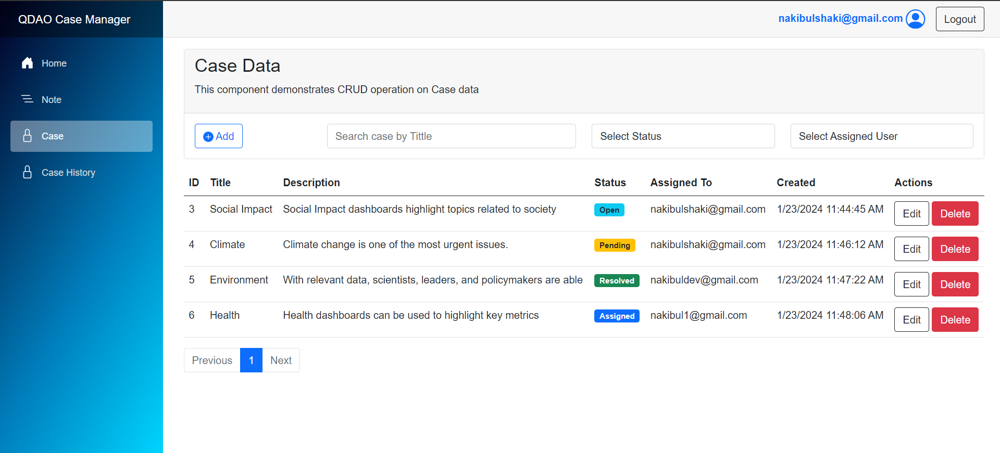

# Case Manager CRUD Application

## Overview
This README provides essential information about the Case Manager CRUD application, highlighting its features, technologies, and deployment details.

## Features
- **CRUD Operations:**
  - Implemented CRUD functionality using .NET 8, Blazor, and EFCore.
  - Utilized ADO.NET Stored Procedures for data manipulation.
- **Database Operations:**
  - Implemented database Trigger for enhanced functionality.
- **RESTful API:**
  - Developed a RESTful API to interact with the application.
- **Service Example:**
  - Demonstrated service examples, leveraging extension methods, middleware and generics.
- **DTOs:**
  - Utilized Data Transfer Objects (DTOs) for efficient data handling.
- **Authentication and Authorization:**
  - Integrated Identity Framework for secure authentication and authorization.
- **Email Notifications:**
  - Implemented SendGrid for seamless email notifications.
- **Blazor Features:**
  - Utilized Blazor Server & Blazor WebAssembly for a flexible project structure.
  - Incorporated reusable Pagination and Confirmation Components.
- **Source Control:**
  - Maintained source code using GitHub for version control.
- **CI/CD Implementation:**
  - Implemented Continuous Integration and Continuous Deployment for streamlined development.

## Deployment
The application is deployed to Azure and can be accessed at [casemanager.azurewebsites.net](https://casemanager.azurewebsites.net).

## Getting Started
To run the application locally or contribute to its development, follow the steps below:
1. Clone the GitHub repository.
2. Set up the required development environment with .NET 8.
3. Configure database connections in the app settings.
4. Run database migrations for EFCore.
5. Build and run the application.

## Contributing
If you wish to contribute to the project, please follow the guidelines outlined in the CONTRIBUTING.md file.

## Issues and Support
For bug reports, issues, or general support, please open an issue on the GitHub repository.

Thank you for using the Case Manager CRUD application!
